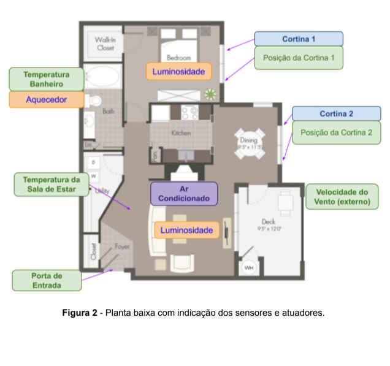
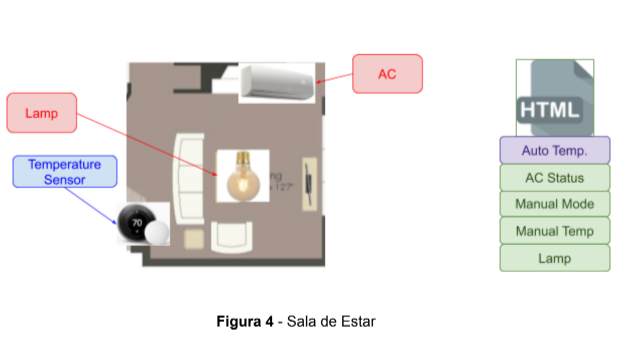
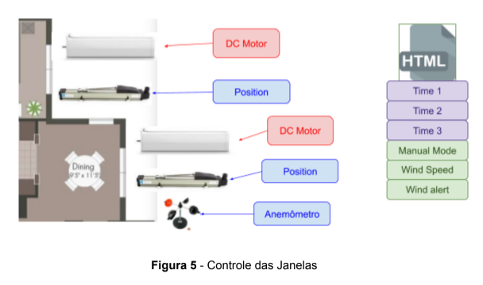
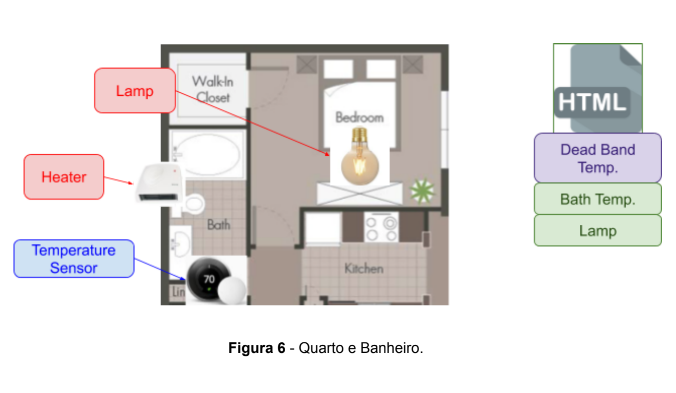

# Projeto Automação e Supervisão
Trabalho final da matéria de Automação 2

* **Objetivo:**

  Projetar um sistema de controle para automatizar um pequeno apartamento. O
sistema deverá monitorar algumas variáveis (temperatura, velocidade do vento..) e atuar
sobre alguns dispositivos (motores, relés, aquecedores...). O estado atual das variáveis é
visualizado através de uma interface WEB, sendo possível atuar sobre elas.

* **Background:**

  A automação residencial, também conhecida como Domótica, derivada do termo em
francês Domotique (Domus significa casa e Imotique significa automática), é um um
conceito de integração dos mecanismos automáticos em um determinado espaço.
Os recursos controlados/monitorados podem ser acessados remotamente mesmo
que o controle e atuação sobre as variáveis sejam locais.
Em resumo, a Domótica pode ser entendida como uma rede que integra e controla a
habitação digital, de forma a adequar as necessidades das pessoas e otimizar as funções
elétricas, tecnológicas e sustentáveis.

   

Na Figura 1, é mostrado um exemplo de controle onde a planta da casa é
visualizada juntamente com os pontos monitorados.

* **Projeto:**

O projeto completo inclui:
1. O desenho esquemático do controlador com modelo virtual para simulação.
2. O desenvolvimento de um firmware em linguagem C/C++ para o controlador.
3. O desenvolvimento de servidor WEB em JavaScript responsável pelo
interfaceamento entre o controlador e o usuário (backend).
4. O desenvolvimento de uma interface WEB para parametrização, monitoração
e atuação sobre o controlador (frontend).

Na Figura 2 é apresentada a planta baixa do apartamento escolhido para o projeto bem
como a disposição dos sensores e atuadores utilizados.

   

* **Descrição do controle

* **Entrada principal:**

Deverá ser monitorado o estado atual da porta, figura 3, por sensor digital
alimentado em 24V.
Uma solenoide, também de 24V, poderá destravar a porta remotamente. Para que
isso seja possível, uma senha (password), previamente definida nos parâmetros de
configuração da interface WEB, deverá ser solicitada ao receber o comando remoto para
destravamento (remote open).
Após destravar, a porta deve ser fechada em um tempo máximo (close timeout),
também definido nos parâmetros de configuração da interface WEB, caso isso não
aconteça, uma alarme sonoro (door status) deve ser ativado de forma intermitente (2 min.
ON, 5 min. OFF), até o fechamento da porta ou desativação manual através de comando
remoto (alarm cancel), também protegido por senha (mesma utilizada para destravar).

* **Sala de estar:**

Conta com sensor de temperatura do tipo digital, este sensor é responsável por ligar
o ar condicionado (AC Status) a fim de manter a temperatura (Auto Temp.) em um valor
previamente definido nos parâmetros de configuração da interface WEB.
O controle do ar condicionado também poderá ser ativado remotamente de forma
manual (Manual Mode), ignorando o sensor de temperatura presente na sala, para isso,
uma saída analógica deverá indicar a temperatura desejada (Manual Temp.), sendo 1,7V
igual a 17 graus celsius, 2,5V 25 graus celsius... O valor desejado deve ser recebido
remotamente.
A luminosidade da sala de estar é controlada remotamente (Lamp), para isso, uma
saída analógica deve ser utilizada, sendo 0V lâmpada desligada e 5V lâmpada em seu
brilho máximo. Ver Figura 4.

   

* **Janelas da sala de estar e jantar:**

As cortinas das janelas são controladas por motores DC de 24V. A posição atual de
cada cortina é monitorada por sensores analógicos, tais sensores indicam indicam 1V
quando a cortina está totalmente fechada e 4V quando totalmente aberta.
As cortinas devem abrir automaticamente conforme horários programados na
página de parâmetros de configuração da interface WEB. Três horários poderão ser
programados:
Horário (Time 1) para abertura na metade do seu curso (Ex. 08:00 horas).
Horário (Time 2) para abertura total (Ex. 12:00 horas).
Horário (Time 3) para fechamento total(Ex. 18:00 horas)

   

A posição de cada cortina também pode ser definida pelo usuário (Manual Mode),
para isso ele pode utilizar um controle do tipo slide, na página de interface, para mover os
motores até a posição desejada.

* **Fechamento de emergência:**
A velocidade do vento (Wind Speed) é monitorada continuamente por um sensor
analógico externo, tal sensor tem a seguinte característica, 0,5V é equivalente a 5 km/h
4,5V é 150 km/h. Sempre que a velocidade do vento for superior a 50 km/h as cortinas
devem ser fechadas e um aviso (Wind Alert) deve ser emitido para a página WEB.

* **Quarto e Banheiro**:

Possui luminosidade controlada remotamente (lamp), para isso, uma saída analógica
deve ser utilizada, sendo 0V lâmpada desligada e 5V lâmpada em seu brilho máximo.
Possui sensor de temperatura analógico (Bath Temp.) do tipo LM35, quando a
temperatura for inferior a 17 graus celsius, o aquecedor deve ser ligado. O controle de
temperatura utilizado é do tipo banda morta, o valor da banda morta (Dead Band Temp.)
deve ser configurado na página de parâmetros de configuração da interface WEB. Figura
6.

   

